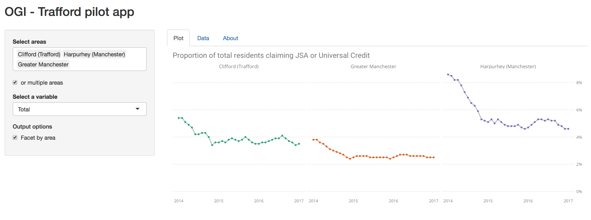

This is the first iteration of the [OGI](http://www.opengovintelligence.eu/) Trafford pilot [Shiny](https://shiny.rstudio.com/) app. 
<br />


</br>
<br />

To run the app locally execute the following code: 

``` r
shiny::runGitHub("trafforddatalab/projects", subdir = "opengovintelligence/apps/ucjsa")
```
